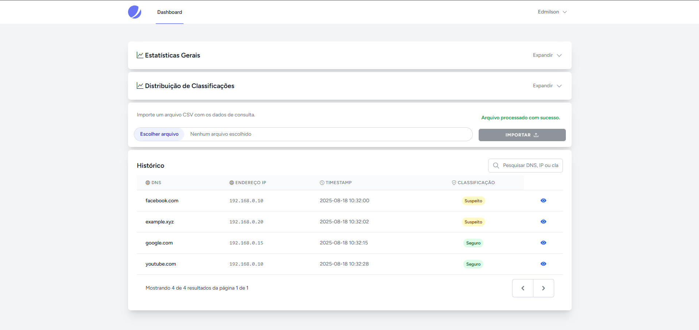
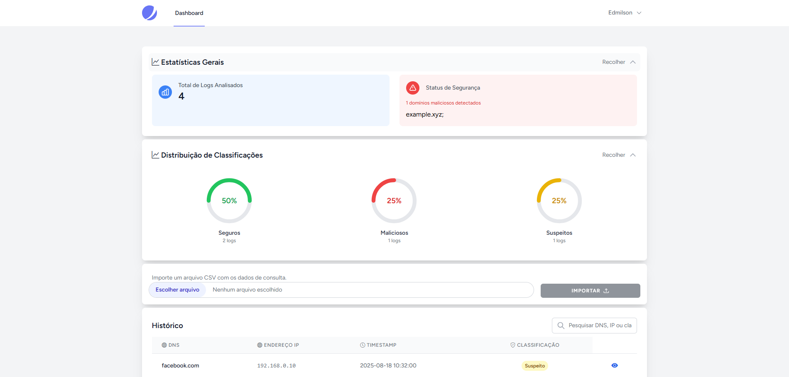
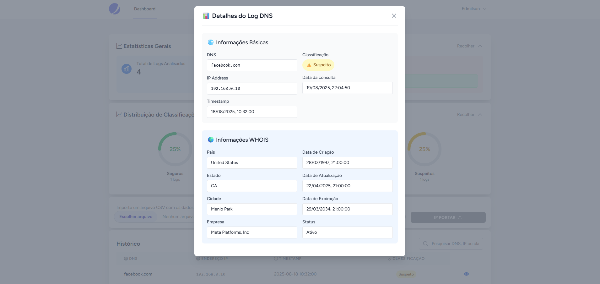

# 🛡️ DNS Log Analyzer

[](https://laravel.com)
[](https://vuejs.org)
[](https://php.net)

## 📋 Requisitos atendidos:

## 🔑 1 - Cadastro de Usuários:
 - Padrão do Jetstream;
 - Cada usuário visualiza apenas seus logs classificados.

## 📁 2 - Entrada de Dados (Logs DNS)
 - Formulário de upload dos logs com indicador de progresso e mensagem de feedback;
 - Dados são armazenados no banco de dados.

## 🤖 3 - Integração com API de IA:
 - Service controla o envio de cada domínio para a API da IA GEMINI;
 - API Retorna a classificação de cada domínio(Seguro, Suspeito ou Malicioso);
 - A classificação é armazenada no banco de dados.

### 💡 (Diferencial):
 - WHOIS com:
    - create_date
    - update_date
    - expiry_date
    - country_name
    - state
    - city
    - company
    - status

## 📊 4 - Interface e Funcionalidades:
 - 10 últimos domínios maliciosos detectados
 - Quantidade de domínios Maliciosos detectados
 - Total de logs analisados
 - Distribuição de Classificações(Seguros, Maliciosos ou Suspeitos)
 - Listagem de logs de domínios
 - Filtro por DNS, IP, Timestamp ou Classificação de risco
 - Paginação básica com informações sobre quantidade de registros e de páginas
 
## 🔌 APIs utilizadas:
 - **Gemini API**: 
    - No Dashboard do [Google AI](https://aistudio.google.com/) é possível Gerar a KEY e acompanhar os dados de uso.
    ```bash
    GEMINI_API_KEY=sua_chave_aqui
    ```
 - **WHOIS Freaks**:
    - Também no Dashboard de [whoisfreaks.com](https://whoisfreaks.com/) é possível gerar a key. 
    ```bash
    WHOIS_FREAKS_API_KEY=sua_chave_aqui
    ```

## 🚀 Execução do projeto:

### 1. Clonar repositório
```bash
git clone https://github.com/EdmilsonMedeiros/desafio-lumium.git
cd desafio-lumium
```

### 2. Instalar dependências
```bash
# Instalar dependências PHP
composer install

# Instalar dependências Node.js
npm install
```

### 3. Configurar ambiente
```bash
# Copiar arquivo de ambiente
cp .env.example .env

# Gerar chave da aplicação
php artisan key:generate
```

### 4. Configurar banco de dados
Configure as variáveis no arquivo `.env`:
```env
DB_CONNECTION=mysql
DB_HOST=127.0.0.1
DB_PORT=3306
DB_DATABASE=dns_log_analyzer
DB_USERNAME=seu_usuario
DB_PASSWORD=sua_senha
```

### 5. Executar migrações
```bash
php artisan migrate
```

### 6. Servir a aplicação

**Opção 1 - Comando único (Recomendado):**
```bash
composer run dev
```
*Este comando inicia servidor Laravel, Vite e queue worker simultaneamente*

**Opção 2 - Comandos separados:**
```bash
# Terminal 1 - Servidor Laravel
php artisan serve

# Terminal 2 - Vite (desenvolvimento frontend)
npm run dev

# Terminal 3 - Queue Worker
php artisan queue:work
```

### 7. Acessar aplicação
Acesse: [http://localhost:8000](http://localhost:8000)


#### Link para access_log.csv que utilizei nos testes:

O arquivo `access_log.csv` está localizado na pasta `public` e pode ser acessado diretamente [aqui](public/access_log.csv).


**Aqui estão algumas capturas de tela do dashboard da aplicação:**

#### Dashboard Principal


#### Dashboard com Gráficos


#### Dashboard com Detalhes


